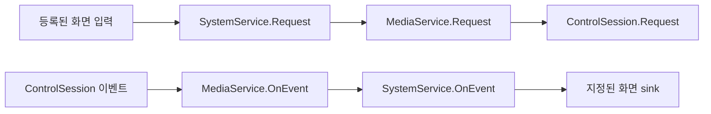

# SystemService / LiveViewer 정적 분석 (2026-10-09)

사용자가 추가 제공한 두 DLL을 ILSpyCmd 9.1.0.7988로 실행 없이 분석했습니다.
원본 식별은 [SHA256 manifest](ssm-routing-manifest.json) 참조. 원본 DLL 및 전체 디컴파일 소스는
공개 저장소/배포 ZIP에 포함하지 않습니다. 아래 VERIFIED는 해당 바이너리의 구현 확인이며,
운영 서버의 지원 계약이나 실제 PTZ 수신 성공을 뜻하지 않습니다. 두 모듈은 net48 대상입니다.

## VERIFIED: 중앙 요청·이벤트 라우터

| 구현 위치 | 확인 내용 |
| --- | --- |
| SystemService.Init | DATA_MAN / MEDIA_MAN 입력 등록; 모델에 따라 추가 모듈 등록 |
| SystemService.AcceptInput | 호출자 ManType의 IViewInputSink 생성·등록 후 입력 연결 |
| IViewInputSink.Request | SystemService.Request로 요청 전달 |
| SystemService.Request / Req_PtzControl | PTZ_CONTROL 분기; SSM_DOMAIN이면 DATA_MAN, 일반 요청은 MEDIA_MAN |
| Req_PtzControl | 첫 payload가 PtzCtrl이면 DataCenter에서 UUID에 해당하는 Camera 검사, ControlHistory에 기록 후 전달 |
| SystemService.RequestEx | 목적지 입력을 찾아 요청자 스택에 SYSTEM_MAN을 넣고 입력 Request 호출 |
| SystemService.OnResponseEx | 요청자 스택을 꺼내 GetInputSinkEx로 응답 전달 |
| SystemService.OnEvent | PTZ_CONTROL을 LIVE_VIEW_MAN / GOOGLEMAP_VIEW_MAN / PLUGIN_VIEW_MAN / VMD_VIEW_MAN / CONFIG_MAN에 전달 |
| DataStructure.BaseMan.OnEventEx | 목록이 있으면 해당 ManType의 등록 sink에만 전달; null일 때 전체 sink에 전달 |

기존 [MediaService / ControlSession 분석](ssm-dll-analysis.md)과 연결하면 다음 경로가 확인됩니다.

이 그림은 확인된 중앙 전달 구간입니다. MapTile.OnRequest와 화면 입력의 직접 연결,
화면 sink에서 MapTile.OnEvent까지의 마지막 구간은 아직 확인하지 못했습니다.
SystemService의 PTZ 이벤트 분기는 지정 목록으로 전달한 뒤 바로 반환합니다.
CLIENT_SDK_MAN은 이 목록에 없고, 이 분기에서 OnCallbackEvent를 호출하지 않습니다.
따라서 일반 SDK 입력이나 OnCallbackEvent에 등록하면 PTZ 이벤트를 받는다고 가정하지 않습니다.
Req_PtzControl의 enqueue/전달 호출과 이벤트 라우팅은 IL에서도 대조했습니다.

## VERIFIED: LiveViewer가 연결하는 구간과 조사 경계

LiveViewForm은 외부 BaseViewerForm을 상속합니다. 생성자에서 LIVE_VIEW_MAN을 설정하고
SYSTEM_MAN을 목적지로 하는 ILiveInput을 추가하며, XScreen을 생성해 MediaControllCenter와
함께 MediatorBase에 등록합니다. OnEvent는 우선 BaseViewerForm.OnEvent를 호출합니다.

제공된 LiveViewer에서 MapTile.OnRequest의 직접 구독이나 MapTile.OnEvent 직접 호출은 찾지 못했습니다.
BaseViewerForm은 HTW.SSM.Libraries.CustomControl.ViewForm.dll,
XScreen은 HTW.SSM.Libraries.MediaProcessings.XScreenControl11.dll에 있는 외부 구현입니다.
이는 남은 UI 연결을 조사할 때의 후보이며 독립 목록 조회를 시작하기 위한 필수 파일은 아닙니다.

## 운영 읽기 전용 구현에 미치는 영향

SystemService는 조회 전용 라이브러리가 아닙니다. 초기화에 설정/관리자/타이머 등 의존성이 있고,
PTZ 전달 전 ControlHistory 기록도 수행합니다. 타이머의 PtzHistoryLog는 큐를 비우고,
기록할 조작 문자열이 있는 경우 LOG_INSERT 요청을 DATA_MAN으로 전달합니다.
그 함수의 문자열 "PTZ Stop"은 로그 메시지이며 카메라 정지 명령 전송을 뜻하지 않습니다.
이 함수에서 위치 구독 START/STOP을 이동 명령으로 바꾸는 호출은 확인되지 않았으나,
모듈 전체 초기화의 읽기 전용 안전성은 입증하지 않았습니다.

독립 .NET 8 Bridge에 기존 SystemService/UI 모듈을 그대로 로드하는 방식은 채택하지 않습니다.
우선 정적으로 확인된 REST 로그인·목록 계약을 중앙 Bridge에서 별도 구현하고,
실응답/권한/전체 범위를 검증해야 합니다. 이후 MediaGateway 인증·세션·PTZ 구독을 별도 단계로 검증합니다.
일반 PTZ_CONTROL은 이동/설정 명령도 전달하므로 읽기 전용으로 간주하지 않습니다.
구독을 구현하더라도 허용 명령을 정확히 제한하고 MOVE_PTZ / SET_ABS_PTZ는 허용하지 않습니다.
브라우저에는 운영 자격 증명이나 원본 SSM DLL을 전달하지 않습니다.

## UNKNOWN 및 다음 현장 확인

- 실제 서버 주소/포트, TLS, 서버 버전 및 공개키: 먼저 확인된 상태 GET 경로로 검사
- 운영자가 허용한 계정의 정상 로그인, 권한 범위, 목록 JSON 및 전체 등록 수 대조
- 실제 카메라의 uint64 ptzCap/ENTITY_CAPABILITY/subType와 구독 가능 여부
- 독립 프로세스의 MediaGateway CONTROL 인증·수신, 이벤트 UUID 및 현재 Pan/Tilt/Zoom
- PTZ 값 단위/정규화 범위, 북쪽 기준 설치 보정, Zoom → FOV, 수신 시각·끊김 처리

현장 우선순위는 [상태 GET → 목록 조회 → 단일 카메라 구독](ssm-web-controller-analysis.md)입니다.
현재 필요한 정보는 회사 SSM 서버 연결 정보와 읽기 전용 상태 응답입니다.
추가 UI DLL 확보를 이 현장 확인의 선행 조건으로 두지 않습니다.
로그인 비밀번호/세션/개인키는 채팅이나 GitHub에 올리지 않습니다.
이번 반영은 분석 문서만이며 기존 실행 파일은 파일 목록 가져오기 방식 그대로입니다.
실서버 접속, DLL 로딩/실행 및 PTZ 명령 전송은 수행하지 않았습니다.
